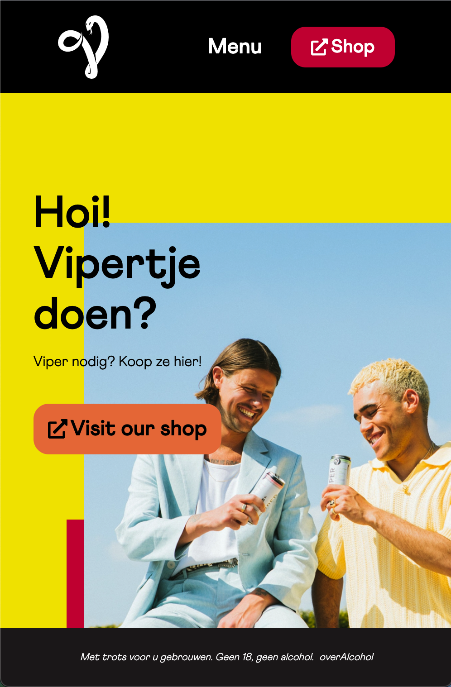

# Procesverslag
Markdown is een simpele manier om HTML te schrijven.  
Markdown cheat cheet: [Hulp bij het schrijven van Markdown](https://github.com/adam-p/markdown-here/wiki/Markdown-Cheatsheet).

Nb. De standaardstructuur en de spartaanse opmaak van de README.md zijn helemaal prima. Het gaat om de inhoud van je procesverslag. Besteedt de tijd voor pracht en praal aan je website.

Nb. Door *open* toe te voegen aan een *details* element kun je deze standaard open zetten. Fijn om dat steeds voor de relevante stuk(ken) te doen.

## Jij

  
uitwerken voor kick-off werkgroep

  ### Auteur:
  Finn Toornent

  #### Je startniveau:
  Rood

  #### Je focus:
  Responsive
 

## Je website

  
uitwerken voor kick-off werkgroep

  ### Je opdracht:
  https://www.viperhardseltzer.nl/

  #### Screenshot(s) van de eerste pagina (small screen): 
  Home - https://www.viperhardseltzer.nl/
  

  #### Screenshot(s) van de tweede pagina (small screen):
  Viper shop - https://shop.grolsch.nl/viper/?_=1696258090763
  
 

## Toegankelijkheidstest 1/2 (week 1)

  
uitwerken na test in 2e werkgroep

  ### Bevindingen
  - De site loopt niet soepel.
  - De carousel werkt niet altijd zoals hij hoort
  - De hover op de buttons zijn buggy in portret modus
  - De html is een bende

  - Het contrast tussen de titel en de prijs op de shop items kan wat duidelijker

## Breakdownschets (week 1)

  
uitwerken na afloop 3e werkgroep

  ### de hele pagina: 
  

  ### dynamisch deel (bijv menu): 
  

  ### wellicht nog een dynamisch deel (bijv filter): 
  

## Voortgang 1 (week 2)

  
uitwerken voor 1e voortgang

  ### Stand van zaken
  Het vormgeven van de header ging heel soepel. Ik vroeg mij af hoe ik het menu het beste kon maken zodat het de hele pagina naar beneden zou scrollen en hier heb ik antwoord op gehad.
  Ik liep aan tegen de vormgeving van de eerste section van de main van de eerste pagina. Heel veel dingen overlapten elkaar namelijk en ik had geen idee hoe ik het na zou kunnen maken zonder position absolute. Uiteindelijk was een grid het beste antwoord. Hiermee heb ik de section bijna perfect kunnen overnemen.
  

  ### Agenda voor meeting
  samen met je groepje opstellen

  | student 1      | student 2          | student 3    | student 4        |
  | ---            | ---                | ---          | ---              |
  | dit bespreken  | en dit             | en ik dit    | en dan ik dat    |
  | en dat ook nog | dit als er tijd is | nog een punt | dit wil ik zeker |
  | ...            | ...                | ...          | ...              |

  ### Verslag van meeting
  hier na afloop snel de uitkomsten van de meeting vastleggen

  - Het menu op height: 0 zetten en height: 100vh maken op button press.
  - Maak de section door middel van een grid.

## Voortgang 2 (week 3)

  
uitwerken voor 2e voortgang

  ### Stand van zaken
  Het javascript gedeelte van de carousel ging hier nog wat lastig. Verder verliep de rest vrij soepel.
    

  ### Agenda voor meeting
  samen met je groepje opstellen

  | student 1      | student 2          | student 3    | student 4        |
  | ---            | ---                | ---          | ---              |
  | dit bespreken  | en dit             | en ik dit    | en dan ik dat    |
  | en dat ook nog | dit als er tijd is | nog een punt | dit wil ik zeker |
  | ...            | ...                | ...          | ...              |

  ### Verslag van meeting
  hier na afloop snel de uitkomsten van de meeting vastleggen

  - Gebruik datatypes voor de carousel plaatjes.
  - Kies als tweede website de grolsch shop pagina, de andere pagina's van viper zijn vrij simpel.
  - 

## Toegankelijkheidstest 2/2 (week 4)

  
uitwerken na test in 9e werkgroep

  ### Bevindingen
- Er zat geen h1 op de eerste pagina, nu wel.
- Ook de decoratieve images hadden een alt, die zijn nu leeg gehouden.
- De controls hadden nog geen focus state. Nu wel.
- De lineheight was een exact getal. Nu niet meer.

## Voortgang 3 (week 4)

  
uitwerken voor 3e voortgang

  ### Stand van zaken
  Ik ben bezig geweest met het maken van de tweede pagina. Deze ging vrij soepel en ik liep alleen soms met de dropdowns tegen problemen aan. Dit had te maken met de reset.css die ik gebruikte die de pijltjes weghaalde.
    

## Eindgesprek (week 5)

  
uitwerken voor eindgesprek

  ### Je uitkomst - karakteristiek screenshots:
  
   

  ### Dit ging goed/Heb ik geleerd: 
  Het responsive maken van de grolsch pagina ging heel soepel naar mijn idee. Vanaf het begin van de opdracht keek ik hier tegenop omdat ik het niet goed snapte maar het ging mij uiteindelijk vrij goed af toen ik het eenmaal snapte.

  

  ### Dit was lastig/Is niet gelukt:
  Wanneer ik op beide pagina's wil navigeren door middel van de tab knop krijg ik niet alle links te zien. Ik snap niet waarom dit is en heb jammer genoeg te weinig tijd om het uit te vogelen.

  

## Bronnenlijst

  
continu bijhouden terwijl je werkt

  Nb. Wees specifiek ('css-tricks' als bron is bijv. niet specifiek genoeg). 
  Nb. ChatGpT en andere AI horen er ook bij.
  Nb. Vermeld de bronnen ook in je code.

  1. https://webdesign.tutsplus.com/how-to-build-a-simple-carousel-with-vanilla-javascript--cms-41734t (Voor een deel van het js gedeelte van de carousel)
  2. https://www.freecodecamp.org/news/html-select-tag-how-to-make-a-dropdown-menu-or-combo-list/ (Voor het select element)
  3. https://www.fontawesome.com voor de iconen

